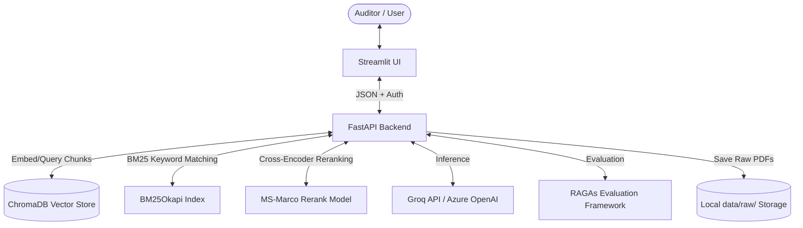

# FinDoc Intelligence (FDI) — System Architecture

This document describes the end-to-end technical architecture, data flows, and design decisions of the FinDoc Intelligence (FDI) RAG system.

---

## 1. System Overview

FinDoc Intelligence is a production-grade Retrieval-Augmented Generation (RAG) system built to assist auditors and financial analysts in querying complex corporate annual reports.



---

## 2. Component Detail

### 2.1 Ingestion Pipeline
- **PDF Parsing:** Uses `pdfplumber` for robust text extraction page-by-page.
- **OCR Fallback:** Uses `pymupdf` (to render pages to PNG) and `pytesseract` to extract text from scanned pages when plain text extraction returns less than 50 characters per page.
- **Table Extraction:** Automatically detects financial grids and converts them into structured Markdown tables before chunking, preserving row/column relations.
- **Contiguous Sliding Window Chunking:** Collects tokens from the entire document, groups them by detected logical sections, and builds sliding window token chunks (`chunk_size=512`, `chunk_overlap=100`) across pages. This avoids short, irrelevant page-bound chunks.

### 2.2 Retrieval Pipeline (Hybrid Search)
- **Semantic Search:** Uses `sentence-transformers/all-MiniLM-L6-v2` to generate 384-dimensional cosine similarity embeddings, returning the top-20 candidate chunks from ChromaDB.
- **BM25 Search:** Tokenizes query keywords and ranks candidate chunks using an in-memory `BM25Okapi` index.
- **Score Fusion:** Combined Score = `0.6 * Semantic Score + 0.4 * Normalized BM25 Score`.
- **Cross-Encoder Reranking:** Applies `cross-encoder/ms-marco-MiniLM-L6-v2` on the top-20 fused candidates, returning the top-3 chunks with refined relevance.

### 2.3 LLM & Generation
- **LLM Engine:** Groq API using `llama-3.3-70b-versatile` or Azure OpenAI for low latency.
- **Hallucination Guard:** If the top-scoring retrieved chunk fails to meet a threshold (default `0.6`), the system abstains from generating a response, outputting a `"LOW CONFIDENCE"` warning and standard placeholder response instead of risking hallucinations.
- **Caching Layer:** Implements a thread-safe, in-memory cache for queries that automatically invalidates when documents are uploaded or deleted.

### 2.4 Evaluation Framework
- **Aggregate Metrics:** Heuristic estimates (latency, context precision via relevance score, faithfulness via confidence level) are computed for every query.
- **Dynamic RAGAs Evaluation:** Evaluates pipeline using RAGAs (`faithfulness`, `answer_relevancy`, `context_precision`) by dynamically generating retrieved contexts and answers from the 20 ground-truth financial QA pairs. It falls back to Groq if `OPENAI_API_KEY` is not present.

---

## 3. Data Flow Diagrams

### Ingestion Flow
```
PDF Uploaded ──> Persist to data/raw/ ──> Extract Text & Markdown Tables 
                  ├──> Empty page? ──> Render Pixmap ──> PyTesseract OCR ──┐
                  └──> Group by Section ──> Sliding Window Token Chunks ───┴──> Store in ChromaDB & BM25
```

### Query Flow
```
User Question ──> Check Cache ──> [Cache Hit] ──> Return Response
                      │
                 [Cache Miss]
                      │
                      ▼
               Hybrid Retrieval ──> Reranking ──> Score >= Threshold? 
                                                      ├──> No ──> Abstain & Warn
                                                      └──> Yes ──> LLM Gen ──> Cache & Return
```
